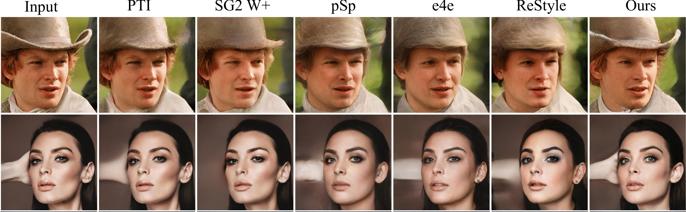

##### Table of contents
1. [Getting Started](#Getting-Started)
2. [Experiments](#Experiments)
3. [Acknowledgments](#Acknowledgments)
4. [Contacts](#Contacts)

# HyperInverter: Improving StyleGAN Inversion via Hypernetwork

<a href="https://di-mi-ta.github.io/HyperInverter/"></a>
<a href="https://arxiv.org/abs/2112.00719"></a>
<!-- <a href="http://colab.research.google.com/github/di-mi-ta/hyper-inverter-code/blob/main/notebooks/demo.ipynb"></a> -->

[Tan M. Dinh](https://di-mi-ta.github.io/),
[Anh Tran](https://sites.google.com/site/anhttranusc/),
[Rang Nguyen](https://sites.google.com/site/rangmanhonguyen/),
[Binh-Son Hua](https://sonhua.github.io/)<br>
VinAI Research, Vietnam

> **Abstract:** 
Real-world image manipulation has achieved fantastic progress in recent years as a result of the exploration and utilization of GAN latent spaces. GAN inversion is the first step in this pipeline, which aims to map the real image to the latent code faithfully. Unfortunately, the majority of existing GAN inversion methods fail to meet at least one of the three requirements listed below: high reconstruction quality, editability, and fast inference. We present a novel two-phase strategy in this research that fits all requirements at the same time. In the first phase, we train an encoder to map the input image to StyleGAN2 W space, which was proven to have excellent editability but lower reconstruction quality. In the second phase, we supplement the reconstruction ability in the initial phase by leveraging a series of hypernetworks to recover the missing information during inversion. These two steps complement each other to yield high reconstruction quality thanks to the hypernetwork branch and excellent editability due to the inversion done in the W space. Our method is entirely encoder-based, resulting in extremely fast inference. Extensive experiments on two challenging datasets demonstrate the superiority of our method.

|  |
|:--:|
| *Our method outperforms significantly other encoder-based methods (pSp, e4e, ReStyle) while having the inferece time as same as them. In comparison with optimization-based approaches (SG2-W+, PTI), our work is on par of quality with SG2-W+, and sightly lower than PTI. However, it is worth noting that, our method run very faster allowing for interactive applications (3000 and 1100 times shorter than SG2-W+ and PTI).*|


Details of the model architecture and experimental results can be found in [our following paper](https://arxiv.org/abs/2112.00719).
```bibtex
@inproceedings{dinh2021hyperinverter,
    title={HyperInverter: Improving StyleGAN Inversion via Hypernetwork},
    author={Tan M. Dinh and Anh Tuan Tran and Rang Nguyen and Binh-Son Hua},
    booktitle={Proceedings of the IEEE/CVF Conference on Computer Vision and Pattern Recognition (CVPR)},
    year={2022}
}
```
**Please CITE** our paper whenever our model implementation is used to help produce published results or incorporated into other software.


## Getting Started

The codebase is tested on
- Ubuntu
- CUDA 10.0, CuDNN 7 

### Installation

- Clone this repo:
``` 
git clone https://github.com/VinAIResearch/HyperInverter.git
cd HyperInverter
```

- Install dependencies:
```
conda create -p ./envs python=3.7.3
conda activate ./envs
pip install -r requirements.txt
```

### Datasets

- **Human Faces**: We use `70,000 images` from [FFHQ](https://github.com/NVlabs/ffhq-dataset) dataset to train, and `2,824 images` from [CelebA-HQ](https://github.com/tkarras/progressive_growing_of_gans) dataset to test. The images have `1024 x 1024` resolution and are cropped and aligned to the center. Refering [FFHQ](https://github.com/NVlabs/ffhq-dataset) for more details about the pre-processing step.

- **Churches**:  We use all `126,227 images` and `300 images` from the official train and test sets of  [LSUN Church](https://www.yf.io/p/lsun) to train and evaluate our model. The images are resized to `256 x 256` resolution.

Please download the corresponding datasets and unzip to the `data` folder. Then, go to `configs/paths_config.py` and modify this file to link data correctly:

``` 
dataset_paths = {
    "ffhq": "/path/to/ffhq/train_img",
    "celeba_test": "/path/to/CelebA-HQ/test_img",
    "church_train": "/path/to/lsun-church/train_img",
    "church_test": "/path/to/lsun-church/test_img",
}
```

If you need to try with your own dataset, you can make the necessary modifications in: (i) `data_configs.py` to define your data paths; (ii) `transforms_configs.py` to define your data transformations.

### Auxiliary pre-trained models
Run the below command to automatically download the auxiliary pre-trained models needed in the experiments.
```
python scripts/download_auxiliary_pretrained_models.py
```
Basicly, we set these paths correctly to training or inference processes. 
If you want to change these paths, please visit file `configs/paths_config.py` and modify the corresponding record in the `model_paths` dict.

## Experiments

### Pre-trained Models.

See [Model Zoo](./MODEL_ZOO.md) for our official pre-trained models. Please download our pretrained models (both W Encoder and HyperInverter) and put them to the `pretrained_models` folder.

<!-- Run the below command to automatically download our HyperInverter pre-trained models. 
```
sh pretrained_models/download_hyperinverter_models.sh
``` -->

### Training
#### Phase I: W Encoder
Please follow [pSp](https://github.com/eladrich/pixel2style2pixel) or [e4e](https://github.com/omertov/encoder4editing.git) to train the W encoder to encode images to latent codes in W space (512). 

To save time, we release our pre-trained W encoders for churches and human faces in [Model Zoo](./MODEL_ZOO.md).

#### Phase II: HyperInverter
We provide the default training scripts as below. If you have time, please tune the hyper-parameters further to get the best results. Note that the argument `--hidden_dim` has a large effect on the quality of the model, increasing them cause a bigger model and tend to have better quality. In the paper, we use `hidden_dim=256`. However, we recommend using `hidden_dim=128` to balance the model size and model performance. In addition, it is worth noting that, our code is also easy to modify for predicting different layer weights of StyleGAN2. Refering to [weight_shapes](./models/weight_shapes.py) for reference and modify them if you need to try with other layers. Then, you modify the `get_target_shapes` function in [hyper_inverter](./models/hyper_inverter.py) to add your option. 

- **Human Faces** 
```
EXPERIMENT_DIR=""
W_ENCODER_PATH=""
GPU_ID=0

CUDA_VISIBLE_DEVICES="$GPU_ID" \
python scripts/train.py \
--dataset_type=ffhq_encode \
--encoder_type=LayerWiseEncoder \
--w_encoder_path="$W_ENCODER_PATH" \
--output_size=1024 \
--exp_dir="$EXPERIMENT_DIR" \
--batch_size=8 \
--batch_size_used_with_adv_loss=4 \
--workers=4 \
--val_interval=1000 \
--save_interval=5000 \
--encoder_optim_name=adam \
--discriminator_optim_name=adam \
--encoder_learning_rate=1e-4 \
--discriminator_learning_rate=1e-4 \
--hyper_lpips_lambda=0.8 \
--hyper_l2_lambda=1.0 \
--hyper_id_lambda=0.1 \
--hyper_adv_lambda=0.005 \
--hyper_d_reg_every=16 \
--hyper_d_r1_gamma=10.0 \
--step_to_add_adversarial_loss=200000 \
--target_shape_name=conv_without_bias  \
--max_steps=500000 \
--hidden_dim=128 \
--num_cold_steps=20000 \
--save_checkpoint_for_resuming_training \
--use_wandb
```

- **Churches**
```
EXPERIMENT_DIR=""
W_ENCODER_PATH=""
GPU_ID=0

CUDA_VISIBLE_DEVICES="$GPU_ID" \
python scripts/train.py \
--dataset_type=church_encode \
--encoder_type=ResNetLayerWiseEncoder \
--w_encoder_path="$W_ENCODER_PATH" \
--output_size=256 \
--exp_dir="$EXPERIMENT_DIR" \
--batch_size=8 \
--batch_size_used_with_adv_loss=4 \
--workers=4 \
--val_interval=1000 \
--save_interval=5000 \
--encoder_optim_name=adam \
--discriminator_optim_name=adam \
--encoder_learning_rate=1e-4 \
--discriminator_learning_rate=1e-4 \
--hyper_lpips_lambda=0.8 \
--hyper_l2_lambda=1.0 \
--hyper_id_lambda=0.5 \
--hyper_adv_lambda=0.15 \
--hyper_d_reg_every=16 \
--hyper_d_r1_gamma=100.0 \
--step_to_add_adversarial_loss=100000 \
--target_shape_name=conv_without_bias \
--max_steps=500000 \
--hidden_dim=128 \
--num_cold_steps=10000 \
--save_checkpoint_for_resuming_training \
--use_wandb
```

### Inference
- Placing the input images in a folder.

- Pre-processing (if needed). 
For human facial domain, if the input images have not been cropped and aligned, please run the below script to preprocess data.

```
RAW_IMAGE_DIR=""
PROCESSED_IMAGE_DIR=""

python scripts/align_all_parallel.py \
--raw_dir "$RAW_IMAGE_DIR" \
--saved_dir "$PROCESSED_IMAGE_DIR" \
--num_threads 8 
```

The descriptions of the arguments are shown below.
| **Args** | **Descriptions** |
| :------- | :---------- |
| `RAW_IMAGE_DIR` | Path to folder containing raw input images |
| `PROCESSED_IMAGE_DIR` |Path to folder saving processed input images |


- Run inference 

Set the argument correctly before running the below script.

```
INPUT_DATA_DIR=""
RESULT_DIR=""
MODEL_PATH=""
GPU_ID=0

CUDA_VISIBLE_DEVICES="$GPU_ID" \
python scripts/inference.py \
--exp_dir="$RESULT_DIR" \
--checkpoint_path="$MODEL_PATH" \
--data_path="$INPUT_DATA_DIR" \
--batch_size=4 \
--workers=4
```

The description of the arguments are shown below. 
| **Args** | **Descriptions** |
| :------- | :---------- |
| `RESULT_DIR` | The directory saved the inference results |
| `MODEL_PATH` | Path to HyperInverter model |
| `INPUT_DATA_DIR` | Path to folder containing processed input images |

Finally, the reconstructed images can be found in `RESULT_DIR/inference_results` folder.

### Quantitative Evaluation
We have prepared the scripts for quantitatively reconstruction evaluation on [human faces](sample_scripts/human_faces_reconstruction_quantitative_evaluation.sh) and [churches](./sample_scripts/church_reconstruction_quantitative_evaluation.sh) models. Please set the arguments to compatible with your model in these files and run below commands to conduct the evaluation process. 
- **Human Faces**
```
sh sample_scripts/human_faces_reconstruction_quantitative_evaluation.sh
```
- **Churches** 
```
sh sample_scripts/church_reconstruction_quantitative_evaluation.sh
```

### Qualitative Comparison

For the following experiments, please visit file `configs/paths_config.py` and update `model_paths` dict with the paths to the pre-trained models of HyperInverter and other inversion methods. For other inversion methods, please visit their Github repositories to download their pre-trained weights. 

#### Reconstruction 
The sample script for qualitatively reconstruction comparison is:
```
DOMAIN=""
METHODS=""
INPUT_DATA_DIR=""
SAVED_RESULTS_DIR_NAME=""
MAX_NUM_IMAGES=100
SAVED_SIZE=1024
GPU_ID=0


CUDA_VISIBLE_DEVICES="$GPU_ID" \
python evaluation/reconstruction_comparison.py \
--methods="$METHODS" \
--domain="$DOMAIN" \
--input_data_dir="$INPUT_DATA_DIR"  \
--input_data_id="$SAVED_RESULTS_DIR_NAME" \
--output_dir=outputs \
--saved_embedding_dir=embeddings \
--max_num_images="$MAX_NUM_IMAGES" \
--resize="$SAVED_SIZE"
```

The descriptions of the arguments are shown below.
| **Args** | **Descriptions** |
| :------- | :---------- |
| `DOMAIN` | The input domain, options are {`human_faces`, `churches`} |
| `METHODS` | The inversion methods, separated by comma, supported methods are {`hyper_inverter`, `psp`, `e4e`, `SG2_plus`, `SG2`, `w_encoder`, `hyper_inverter`, `restyle_e4e`} |
| `INPUT_DATA_DIR` | Path to folder containing processed input images |
| `SAVED_RESULTS_DIR_NAME` | The name of folder saving results |
| `MAX_NUM_IMAGES` | The maximum of number images to process |
| `SAVED_SIZE` | The size of saved images for each method |

The results can be found in the `outputs/SAVED_RESULTS_DIR_NAME` folder.

#### Editing
The sample script for editing comparison is:
```
DOMAIN=""
METHODS=""
DIRECTION=""
INPUT_DATA_DIR=""
SAVED_RESULTS_DIR_NAME=""
MAX_NUM_IMAGES=10
SAVED_SIZE=1024
MIN_MAG=-30  
MAX_MAG=30
STEP=5 
GPU_ID=0

CUDA_VISIBLE_DEVICES="$GPU_ID" \
python evaluation/editing_inference.py \
--methods="$METHODS" \
--domain="$DOMAIN" \
--input_data_dir="$INPUT_DATA_DIR" \
--input_data_id="$SAVED_RESULTS_DIR_NAME" \
--output_dir=outputs \
--saved_embedding_dir=embeddings \
--direction="$DIRECTION" \
--min_factor="$MIN_MAG" \
--max_factor="$MAX_MAG" \
--step="$STEP" \
--max_num_images="$MAX_NUM_IMAGES" \
--resize="$SAVED_SIZE" \
--save_edited_images \
--gif_speed=4 
```

The results can be found in the `outputs/SAVED_RESULTS_DIR_NAME` folder. Please try with different values of `MIN_MAG` and `MAX_MAG` to get the best result.

The descriptions of the arguments are shown below.
| **Args** | **Descriptions** |
| :------- | :---------- |
| `DOMAIN` | The input domain, options are {`human_faces`, `churches`} |
| `METHODS` | The inversion methods, separated by comma, supported methods are {`hyper_inverter`, `psp`, `e4e`, `SG2_plus`, `SG2`, `w_encoder`, `restyle_e4e`}, for example: `hyper_inverter,psp,e4e` |
| `DIRECTION` | The editing direction, the supported directions are shown the below table | 
| `INPUT_DATA_DIR` | Path to folder containing processed input images |
| `MIN_MAG` | The minimum editing magnitude, please tune this argument to get the best result |
| `MAX_MAG` | The maximum editing magnitude, please tune this argument to get the best result |
| `STEP` | The step we move from min magnitude to max magnitude |
| `SAVED_RESULTS_DIR_NAME` | The name of folder saving results |
| `MAX_NUM_IMAGES` | The maximum of number images to process |
| `SAVED_SIZE` | The size of saved images for each method |

The supported editing directions are listed below. 
- **Human Faces**

| **Method** | **Editing Directions** |
| :---------- | :---------- |
| [GANSpace](https://github.com/harskish/ganspace) | `eye_openness`, `trimmed_beard`, `lipstick` `face_roundness`, `nose_length`, `eyebrow_thickness`, `head_angle_up`, `displeased` |
| [InterFaceGAN](https://github.com/genforce/interfacegan) | `age`, `smile`, `rotation` |
| [StyleCLIP](https://github.com/orpatashnik/StyleCLIP) | `surprised`, `afro`, `angry`, `beyonce`, `bobcut`, `bowlcut`, `curly_hair`, `hilary_clinton`, `depp`, `mohawk`, `purple_hair`, `taylor_swift`, `trump`, `zuckerberg` |

- **Churches**

| **Method** | **Editing Directions** |
| :---------- | :---------- |
| [GANSpace](https://github.com/harskish/ganspace) | `clouds`, `vibrant`, `blue_skies`, `trees` |


### Applications: Real-world image interpolation

The sample script for the interpolation of two real images is:
```
DOMAIN=""
METHODS=""
PATH_TO_INPUT_IMAGE_1=""
PATH_TO_INPUT_IMAGE_2=""
SAVED_RESULTS_DIR=""
SAVED_RESULTS_FILE_NAME=""
SAVED_SIZE=1024
NUM_STEPS=100
GPU_ID=0

CUDA_VISIBLE_DEVICES="$GPU_ID" \
python evaluation/real_image_interpolation.py \
--domain="$DOMAIN" \
--method="$METHODS" \
--left_image_path="$PATH_TO_INPUT_IMAGE_1" \
--right_image_path="$PATH_TO_INPUT_IMAGE_2" \
--steps="$NUM_STEPS" \
--saved_image_size="$SAVED_SIZE" \
--saved_dir="$SAVED_RESULTS_DIR" \
--saved_file_name="$SAVED_RESULTS_FILE_NAME" \
--save_interpolated_images \
--gif_speed=2
```

The descriptions of the arguments are shown below.
| **Args** | **Descriptions** |
| :------- | :---------- |
| `DOMAIN` | The input domain, options are {`human_faces`, `churches`} |
| `METHODS` | The inversion methods, separated by comma, supported methods are {`hyper_inverter`, `psp`, `e4e`, `SG2_plus`, `SG2`, `w_encoder`, `restyle_e4e`}, for example: `hyper_inverter,psp,e4e` |
| `PATH_TO_INPUT_IMAGE_1` | Path to the input image 1 |
| `PATH_TO_INPUT_IMAGE_2` | Path to the input image 2 |
| `NUM_STEPS` | Number of interpolation steps |
| `SAVED_RESULTS_DIR` | The path to folder saving results |
| `MAX_NUM_IMAGES` | The maximum of number images to process |
| `SAVED_RESULTS_FILE_NAME` | The name of gif result file |
| `SAVED_SIZE` | The size of saved images for each method |

## Acknowledgments
Our source code is developed based on the codebase of a great series of StyleGAN inversion researches from the Tel Aviv University group, which are: [pSp](https://github.com/danielroich/PTIhttps://github.com/danielroich/PTI), [e4e](https://github.com/omertov/encoder4editing), [ReStyle](https://github.com/yuval-alaluf/restyle-encoder) and [PTI](https://github.com/danielroich/PTI). 

For auxiliary pre-trained models, we specifically thank to [TreB1eN](https://github.com/TreB1eN/InsightFace_Pytorch), [MoCov2](https://github.com/facebookresearch/moco), [CurricularFace](https://github.com/HuangYG123/CurricularFace) and [MTCNN](https://github.com/TreB1eN/InsightFace_Pytorch). For editing directions, thanks to the authors of [GANSpace](https://github.com/harskish/ganspace), [InterFaceGAN](https://github.com/genforce/interfacegan) and [StyleCLIP](https://github.com/orpatashnik/StyleCLIP).

We leverage the PyTorch implementation of [StyleGAN2-ADA](https://github.com/NVlabs/stylegan2-ada-pytorch) for the StyleGAN model. All pre-trained StyleGAN models are from the official release of [StyleGAN2](https://drive.google.com/drive/folders/1yanUI9m4b4PWzR0eurKNq6JR1Bbfbh6L). We convert the original weights exported by TensorFlow code to compatible with the PyTorch version of StyleGAN2-ADA by using [the author's official script](https://github.com/NVlabs/stylegan2-ada-pytorch/blob/main/legacy.py).

Overall, thank you so much to the authors for their great works and efforts to release source code and pre-trained weights.

## Contacts
If you have any questions, please drop an email to _tan.m.dinh.vn@gmail.com_ or open an issue in this repository.